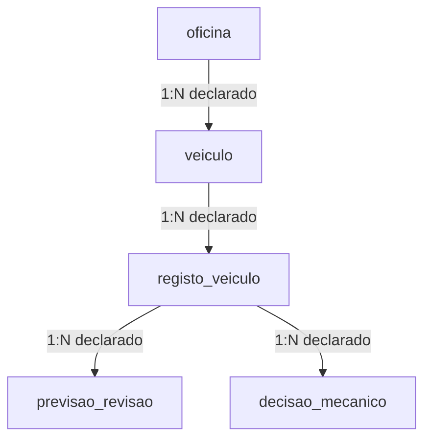

# Arquitetura | Oficina Automóvel

[Apresentação](./README.md) · [Evidências e limites](./evidencias-e-limites.md)

## Separação de responsabilidades

| Componente da entrega | Responsabilidade observada |
| --- | --- |
| `main.py` | Inicialização, importação de dados e menu de terminal |
| `database/` | Conexão SQLite e criação de tabelas |
| `models/` | Objetos de oficina, veículo, registo e revisão |
| `dao/` | Inserções, consultas, exclusão de veículo e persistência de previsões |
| `services/` | Importação de JSON/CSV e uma função separada de previsão por regras |
| `ml/previsao_real.py` | Carregamento do modelo com Joblib e chamada a `predict` |
| `dados/` | Arquivos de entrada utilizados nos testes acadêmicos |

Os caminhos acima descrevem o ZIP analisado; não são links para código publicado nesta pasta. A função de regras em `services/previsao.py` não é a função de previsão importada pelo menu principal.

## Modelo relacional declarado

O desenho separa cadastro, observações técnicas e resultados. As duas tabelas finais permitem representar previsão automática e decisão humana separadamente.

As relações representam as referências declaradas no esquema. A conexão fornecida não habilita explicitamente a verificação de chaves estrangeiras; campos relacionais também aceitam valores nulos. Portanto, o diagrama expressa o desenho pretendido, não uma garantia de integridade já validada.

| Entidade | Conteúdo principal |
| --- | --- |
| `oficina` | Identificação, nome, localização e população do concelho |
| `veiculo` | Matrícula, marca, combustível, portas e oficina associada |
| `registo_veiculo` | Data/hora e medições técnicas do veículo |
| `previsao_revisao` | Resultado previsto, data/hora e identificação do modelo |
| `decisao_mecanico` | Decisão final, data/hora e observações |

A tabela de decisão humana existe no esquema, mas não foi identificado um fluxo de registro dessa decisão no menu entregue.

## Contrato de entrada da previsão

A função integrada ao menu recebe os seguintes atributos, nesta ordem:

| Posição | Atributo | Semântica indicada pelo enunciado |
| --- | --- | --- |
| 1 | Quilometragem desde a última revisão | Valores em milhares de quilômetros |
| 2 | Nível de óleo adequado | 0 = não; 1 = sim |
| 3 | Alarmes no painel | Contagem de 0 a 3 |
| 4 | Espessura dos discos de travão | Intervalo de 15 a 65 mm |

O conjunto do Projeto I tem seis atributos; combustível e número de portas não são enviados pela função do Projeto II. Sem o treinamento, não é possível confirmar como ocorreu essa seleção nem se o tratamento dos dados é consistente entre treino e inferência.

O código registra o identificador `DecisionTreeClassifier`, e o arquivo serializado contém referências textuais a essa classe. Essa evidência não comprova como o modelo foi treinado nem sua qualidade.

## Limites de execução

- O menu importa os dados a cada inicialização; novos registos técnicos podem ser inseridos repetidamente.
- O caminho do modelo é relativo ao arquivo do módulo, mas os caminhos do banco e das entradas dependem do diretório de execução.
- O modelo é carregado durante a importação do módulo. Uma falha nessa etapa pode impedir inclusive o acesso às opções não relacionadas à IA.
- O relatório estatístico consulta uma tabela incompatível com o esquema atual.
- A entrega não inclui arquivo de dependências nem roteiro de treinamento reproduzível.

Por esses motivos, ainda não é apresentado um comando de instalação como se a execução completa estivesse validada.
