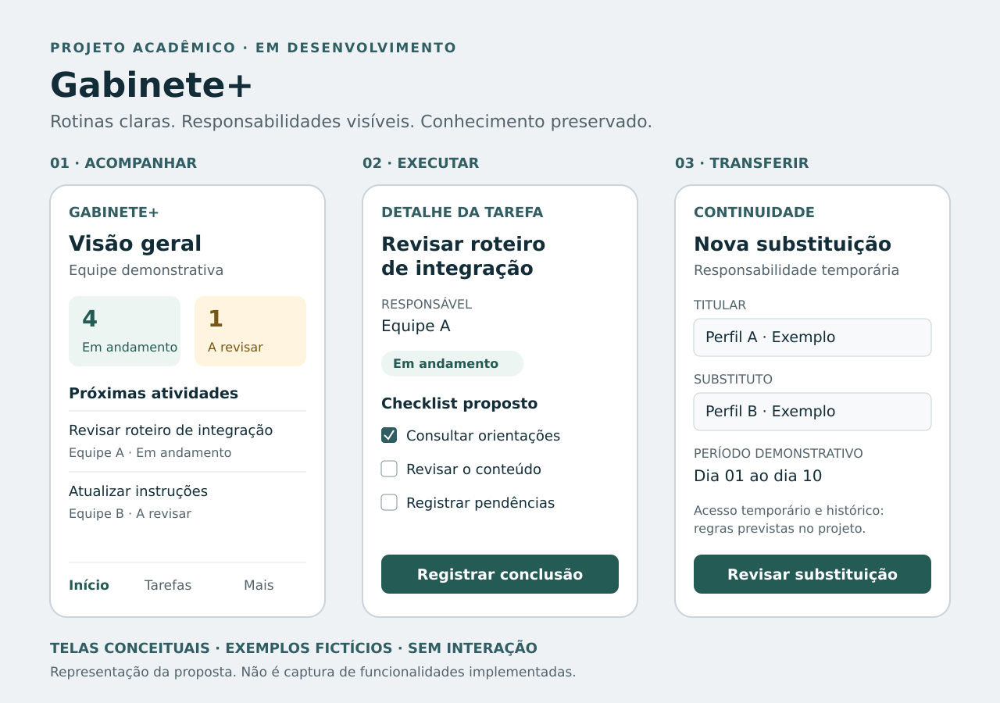

# Gabinete+

### Organização de rotinas e continuidade do conhecimento

Projeto acadêmico de uma aplicação mobile para organizar atividades, apoiar substituições temporárias e preservar orientações de trabalho em gabinetes de desembargadores.

**Alessandra Souza Garcia · Análise e Desenvolvimento de Sistemas · UNISINOS**

> **Em desenvolvimento.** Esta é uma apresentação pública do projeto, não uma aplicação operacional. As telas são representações conceituais, com exemplos inteiramente fictícios. O código de desenvolvimento permanece em repositório privado.

[Estudo de caso](./estudo-de-caso.md) · [Arquitetura e estágio técnico](./arquitetura.md) · [Requisitos e próximos passos](./requisitos-e-roadmap.md) · [Voltar ao portfólio](../../README.md)

*Ilustração editorial da proposta. Não é captura do aplicativo implementado e não contém dados de uma equipe real.*

## O problema

Rotinas distribuídas entre mensagens, documentos e controles paralelos dificultam a consulta de orientações e a transferência de responsabilidades. Em mudanças de função ou afastamentos, parte do conhecimento pode depender de explicações informais e da memória de quem executa o trabalho.

O Gabinete+ propõe organizar esse conhecimento por atividade, com responsáveis, instruções e histórico, para apoiar a continuidade do trabalho.

## A solução proposta

| Módulo planejado | Necessidade atendida |
|---|---|
| Atividades e instruções | Registrar como executar uma rotina e manter orientações atualizáveis. |
| Tarefas e checklists | Transformar atividades em ocorrências acompanháveis, com prazo e responsável. |
| Equipe e responsabilidades | Identificar quem responde pelo trabalho, sem vincular permanentemente a função a uma pessoa. |
| Substituições temporárias | Organizar transições de responsabilidade durante afastamentos. |
| Histórico e relatórios | Preservar registros de alterações, pendências e devolução de tarefas. |

Esses módulos representam requisitos e desenho de solução; não são funcionalidades concluídas na base técnica examinada.

## O que já existe

- Documentação de perfis de usuários, atividades, regras iniciais e navegação.
- Wireframes de baixa fidelidade e roteiro para validação com usuários.
- Estrutura de projeto com aplicativo mobile, API e pacote compartilhado.
- API com rota `/health`, esquema de resposta e teste automatizado dessa rota.
- Modelo inicial de usuário no banco de dados e migração correspondente.
- Configuração de ferramentas de desenvolvimento e integração contínua.

**Limites atuais:** a interface mobile ainda utiliza a base inicial do Expo. Não há implementação dos módulos de gestão, autenticação completa ou autorização por função. A existência de testes e configurações no código não significa que tenham sido executados ou aprovados nesta apresentação.

## Base tecnológica

| Camada | Tecnologias presentes na estrutura inicial |
|---|---|
| Aplicativo | TypeScript, React Native, Expo e Expo Router |
| API | Node.js, Express e Zod |
| Persistência | PostgreSQL e Prisma |
| Organização | Monorepo com pnpm e pacote de tipos/esquemas compartilhados |
| Qualidade e ambiente | ESLint, Prettier, Vitest, Supertest, Docker Compose e GitHub Actions |

As tecnologias acima descrevem arquivos e dependências da base revisada; não representam experiência de operação em produção. [Ver detalhes e limites técnicos](./arquitetura.md).

## Valor esperado

Para a equipe, a proposta busca facilitar a consulta de instruções, explicitar responsabilidades e reduzir perdas de contexto nas transições. Para a prestação jurisdicional, a contribuição esperada é indireta: apoiar a organização administrativa e a continuidade do trabalho.

**Esses benefícios são hipóteses a validar.** Ainda não há resultados medidos de redução de tempo, retrabalho ou melhoria do serviço.

## O que este projeto demonstra no portfólio

Articulação entre conhecimento de processos de trabalho e formação em tecnologia: definição de um problema, levantamento de requisitos, modelagem de responsabilidades, desenho de interfaces, organização da arquitetura e planejamento incremental da implementação.

O estágio atual é apresentado de forma explícita para distinguir a concepção da solução do software efetivamente construído.

## Privacidade e escopo público

Esta pasta não inclui respostas individuais de pesquisa, bases institucionais, credenciais, listas de servidores ou arquivos de produção. Os exemplos visuais foram criados exclusivamente para o portfólio.

O material não é uma publicação oficial de tribunal nem indica integração ou implantação institucional. A seleção pública não substitui uma revisão do histórico do repositório ou de outros documentos do portfólio.

**Referência da descrição técnica:** cópia do projeto recebida para revisão em agosto de 2026. O desenvolvimento privado pode evoluir independentemente desta apresentação.
