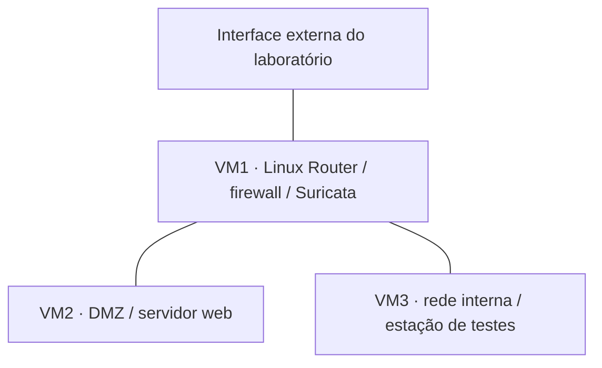

# Trabalho 1 · Redes e defesa perimetral

[Visão geral dos laboratórios](./README.md)

## Objetivo

Montar uma infraestrutura virtual com zonas de confiança distintas e exercitar o controle do tráfego entre rede interna, DMZ e interface externa do laboratório.

**Tecnologias:** CentOS Stream 9, VirtualBox, IPTables/Netfilter, NAT, Apache e Suricata.

## Arquitetura documentada

Diagrama conceitual, sem endereços ou identificadores do ambiente original. O roteador concentra a ligação entre as três zonas.

## Trabalho desenvolvido pela equipe

- Provisionamento das máquinas virtuais e configuração das interfaces de rede.
- Políticas de descarte por padrão nas cadeias INPUT e FORWARD, acompanhadas de exceções.
- Tradução de endereços com masquerade e publicação do serviço web com DNAT.
- Assinaturas Suricata para padrões de acesso a arquivos, SQLi, XSS e varredura de portas.
- Plano de testes de conectividade, restrições de acesso e geração de alertas.

## O que os materiais demonstram

| Elemento | Registro disponível | Leitura para o portfólio |
|---|---|---|
| Segmentação | Topologia e configuração das VMs | Exercício de organização da rede em zonas |
| Firewall e NAT | Comandos no relatório e arquivo auxiliar | Implementação documentada, sem nova validação de execução |
| Monitoramento | Regras locais do Suricata | Detecção baseada em assinaturas selecionadas |
| Resposta | Descrição de bloqueio manual com IPTables após alerta | Integração entre observação e intervenção administrativa |
| Validação | Plano de testes e conclusão narrativa | Evidência documental, sem conjunto completo de logs por teste |

## Aprendizados e limites

O exercício conecta três atividades diferentes: permitir o tráfego necessário, identificar padrões suspeitos e decidir como responder a um alerta.

**Precisão importante:** embora o objetivo inicial mencione bloqueio automático, a seção 5.3 descreve resposta **manual** no IPTables. Por isso, esta apresentação não afirma a implementação de um IPS automático.

A existência de uma política padrão de descarte não demonstra, por si só, que todas as exceções sejam mínimas. O relatório contém uma permissão ampla da LAN para a interface externa; sua ordem e abrangência devem ser consideradas ao avaliar a política efetiva. Os comandos originais não são oferecidos aqui como configuração pronta para produção.

## Fontes

`TP1.pdf`, seções 2 a 6, páginas 2–11; arquivos `comandos_iptables.txt` e `local_rules_suricata.txt`. Síntese documental, sem execução dos comandos nesta revisão.

[Próximo: VPN e identidade digital](./trabalho-2-vpn.md) · [Evidências e limites](./evidencias-e-limites.md)
