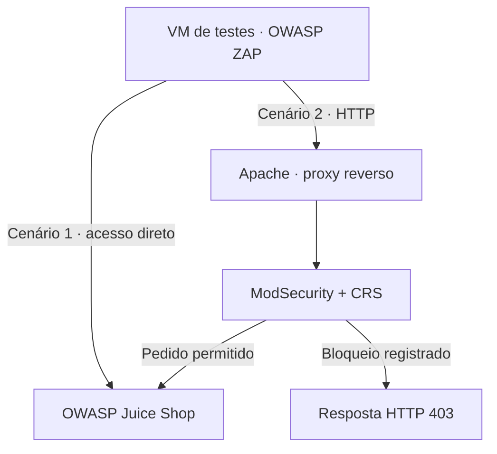

# Trabalho 3 · Segurança web e avaliação de WAF

[Visão geral dos laboratórios](./README.md)

[Baixar trabalho completo — ZIP revisado](./materiais/trabalho-pratico-3-publico.zip?raw=true) · [Nota sobre a revisão](./materiais/README.md)

## Objetivo

Comparar o comportamento de uma aplicação intencionalmente vulnerável antes e depois da introdução de uma Web Application Firewall (WAF), relacionando testes, respostas HTTP e registros de auditoria.

**Alvo de laboratório:** OWASP Juice Shop.  
**Tecnologias:** Kali Linux, CentOS Stream 9, OWASP ZAP, referencial OWASP WSTG, Node.js, Apache, ModSecurity e OWASP Core Rule Set (CRS).  
**Entrega original:** relatório de 114 páginas e dois arquivos de configuração.

## Metodologia

1. Preparar uma VM de testes e uma VM servidora em rede de laboratório.
2. Inspecionar a aplicação diretamente com OWASP ZAP e verificações manuais.
3. Introduzir Apache como proxy reverso, com ModSecurity e CRS.
4. Repetir cenários selecionados e comparar respostas, logs e limitações remanescentes.

## Mudança de arquitetura

Fluxo conceitual: o ModSecurity é um módulo integrado ao Apache, não uma máquina adicional. HTTPS/TLS e testes de lógica de negócio foram excluídos do escopo declarado no relatório.

## Comparação documentada

| Cenário | Antes da WAF | Após a WAF | Limite da conclusão |
|---|---|---|---|
| SQLi na autenticação | Bypass descrito no relatório | Bloqueio HTTP 403 e registros das regras 942100 e 949110 | Evidência para a requisição testada, não eliminação de toda SQLi |
| Cargas com assinaturas XSS | Avaliação da aplicação sem filtro perimetral | Bloqueios registrados para parâmetros e corpo JSON | Bloquear uma carga não comprova que toda forma de XSS foi corrigida |
| Acesso indevido a objetos | Falha de autorização relatada | Persistência relatada com WAF ativa | A filtragem observada não substituiu a autorização da aplicação |
| Token no armazenamento local | Persistência de token registrada | Comportamento mantido | Não houve alteração da implementação de sessão pelo proxy |
| Conteúdo processado no navegador | Análise de entradas no cliente | Limitação de inspeção descrita para fragmentos de URL | O relatório reconhece a necessidade de correções na aplicação |

As classificações são restritas aos cenários registrados. Não foi calculada uma taxa global de eficácia nem realizada uma nova auditoria.

## Evidência técnica em destaque

A figura 55, na página 87 do relatório, registra a detecção da requisição SQLi pela regra **942100**, seguida do bloqueio **949110**, com resposta **403**. Esse vínculo entre requisição, regra e resposta é mais específico do que afirmar apenas que “a WAF funcionou”.

As páginas 96–100 registram outros testes de bloqueio. As páginas 90–95 e 108–112 discutem problemas que permaneceram. Esta apresentação sintetiza essas evidências sem copiar tokens, cabeçalhos de autenticação ou capturas brutas.

## Aprendizados e limites

- Combinar ferramentas automatizadas com análise manual das requisições e dos registros.
- Distinguir alerta, bloqueio observado e correção da vulnerabilidade na aplicação.
- Reconhecer o alcance das regras de assinatura e as limitações do controle perimetral.
- Documentar exclusões de escopo e resultados inconclusivos, sem transformar ausência de evidência em garantia de segurança.

Há divergências entre algumas classificações das duas fases e entre versões de componentes mencionadas no relatório. Por isso, não se reproduz aqui a totalidade das classificações nem se fornece uma receita de instalação baseada nesses números. Os arquivos originais são material de laboratório, não uma configuração validada para produção.

## Fontes

`TP3.pdf`: introdução e arquitetura, páginas 1–8; auditoria, páginas 9–71; implantação, páginas 72–74; comparação e conclusão, páginas 75–114. Arquivos auxiliares: `juiceshop.conf.txt` e `mod_security.conf.txt`.

[Anterior: VPN](./trabalho-2-vpn.md) · [Evidências e limites](./evidencias-e-limites.md)
